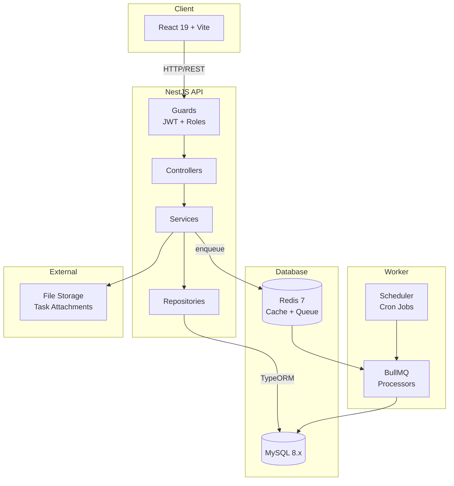
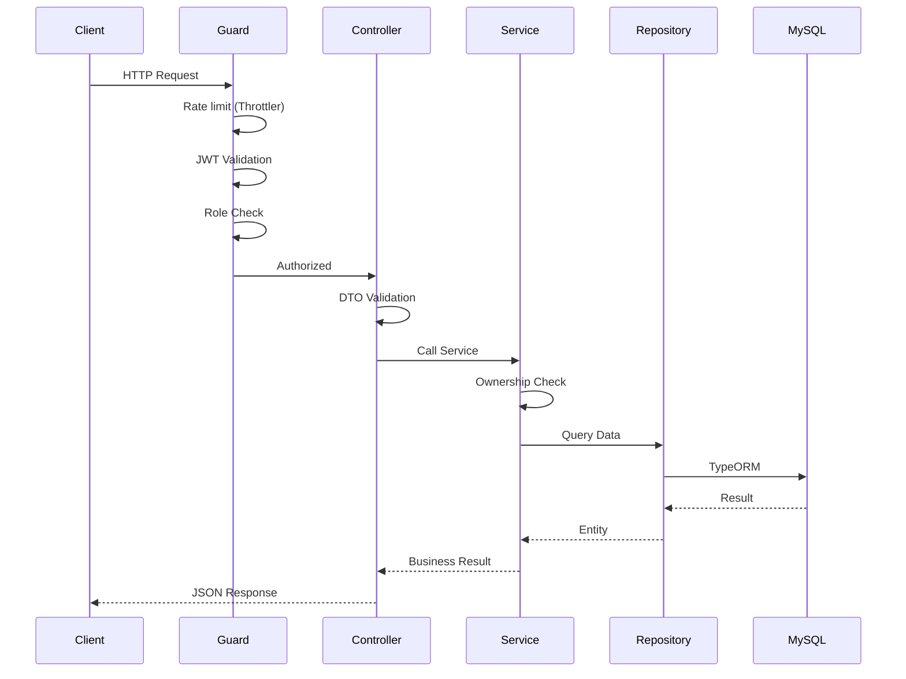
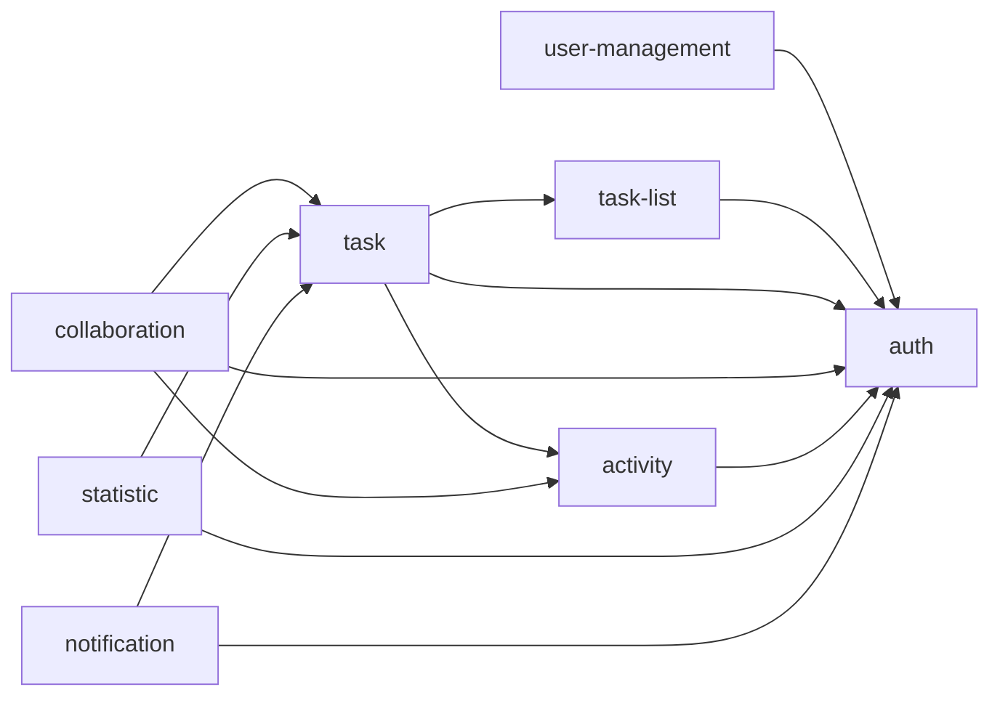

# Backend Architecture

## System Overview



**Architecture**: Monolith with feature-based modules
- Each feature = 1 NestJS module (self-contained)
- Easy to extract to microservices later if needed
- Worker chạy cùng codebase, khác process — tách container khi job chiếm CPU của API

---

## Folder Structure

```
src/
├── main.ts                         # Bootstrap, global pipes/filters
├── app.module.ts                   # Root module, imports all features
│
├── config/
│   ├── database.config.ts          # TypeORM configuration
│   ├── jwt.config.ts               # JWT secret, expiration
│   ├── redis.config.ts             # Cache + queue connection
│   ├── storage.config.ts           # Local | S3 driver
│   └── app.config.ts               # PORT, NODE_ENV, CORS, TZ
│
├── core/
│   ├── database/
│   │   └── database.module.ts      # TypeORM connection (async)
│   ├── logger/
│   │   └── logger.module.ts        # Pino, requestId, redact secrets
│   ├── cache/
│   │   └── cache.module.ts         # Redis cache manager
│   ├── queue/
│   │   └── queue.module.ts         # BullMQ registration
│   └── storage/
│       └── storage.module.ts       # Upload abstraction
│
├── shared/
│   ├── decorators/
│   │   ├── current-user.decorator.ts
│   │   ├── roles.decorator.ts
│   │   └── public.decorator.ts
│   ├── filters/
│   │   └── http-exception.filter.ts
│   ├── guards/
│   │   ├── jwt-auth.guard.ts
│   │   └── roles.guard.ts
│   ├── interceptors/
│   │   ├── transform.interceptor.ts
│   │   └── logging.interceptor.ts
│   ├── pipes/
│   │   └── validation.pipe.ts
│   ├── utils/
│   │   ├── pagination.util.ts
│   │   ├── hash.util.ts
│   │   └── date-range.util.ts      # startOfDay/endOfDay theo timezone user
│   ├── constants/
│   │   └── error-codes.constant.ts # AUTH_001, TASK_001... (nguồn duy nhất)
│   └── types/
│       ├── response.type.ts
│       └── pagination.type.ts
│
└── features/
    ├── auth/                       # roles, users, refresh_tokens, JWT
    ├── user-management/            # admin CRUD user, đổi role, khoá tài khoản
    ├── task-list/                  # task_lists
    ├── task/                       # tasks, tags, task_tags, today, overdue
    ├── collaboration/              # task_comments, task_attachments
    ├── activity/                   # task_activities (lịch sử, append-only)
    ├── statistic/                  # user_daily_stats, dashboard thống kê
    └── notification/               # notifications, nhắc hạn
```

---

## Feature Anatomy

### Simple Feature (task-list)
```
features/task-list/
├── task-list.module.ts
├── task-list.controller.ts
├── task-list.service.ts
├── repositories/
│   └── task-list.repository.ts
├── dto/
│   ├── create-task-list.dto.ts
│   ├── update-task-list.dto.ts
│   └── reorder-lists.dto.ts
├── entities/
│   └── task-list.entity.ts
├── tests/
└── CONTEXT.md
```

### Complex Feature (task) — Multiple controllers/services
```
features/task/
├── task.module.ts
├── controllers/
│   ├── task.controller.ts              # /tasks
│   ├── task-view.controller.ts         # /tasks/today, /overdue, /upcoming
│   ├── tag.controller.ts               # /tags
│   └── admin-task.controller.ts        # /admin/tasks
├── services/
│   ├── task.service.ts                 # CRUD + ownership
│   ├── task-status.service.ts          # State machine (xem bên dưới)
│   ├── task-view.service.ts            # Logic trang "Hôm nay"
│   ├── task-tag.service.ts             # Gán/gỡ tag (PUT replace)
│   └── recurring-task.service.ts       # Sinh task từ recurrence_rule
├── repositories/
│   ├── task.repository.ts
│   └── tag.repository.ts
├── entities/
│   ├── task.entity.ts
│   └── tag.entity.ts
├── processors/
│   └── recurring-task.processor.ts     # BullMQ consumer
├── dto/
├── types/
│   ├── task-status.type.ts
│   └── task-priority.type.ts
├── tests/
└── CONTEXT.md
```

### Feature with Business Logic (activity)
```
features/activity/
├── activity.module.ts
├── activity.controller.ts              # /activities, /admin/activities
├── services/
│   ├── activity.service.ts             # Truy vấn lịch sử
│   └── activity-logger.service.ts      # Ghi log — BẮT BUỘC nhận EntityManager
├── repositories/
│   └── activity.repository.ts
├── entities/
│   └── task-activity.entity.ts
├── types/
│   └── activity-action.type.ts
├── tests/
└── CONTEXT.md
```

**Quy tắc tách file**: một service vượt ~300 dòng hoặc phục vụ 2 trường hợp sử dụng không liên quan thì tách. `task.service.ts` phình to là dấu hiệu đầu tiên của "god service".

### CONTEXT.md của mỗi feature

Mỗi feature giữ 1 file `CONTEXT.md` ngắn (≈1 trang) gồm: bảng DB feature sở hữu, danh sách endpoint, quy tắc nghiệp vụ riêng, và các feature nó phụ thuộc. Đây là thứ đọc đầu tiên khi quay lại code sau 3 tháng, hoặc khi giao việc cho người mới.

---

## Request Flow



### Layer Responsibilities

| Layer | Responsibility |
|-------|----------------|
| Guard | Rate limit, JWT validation, role checking |
| Controller | Routing, DTO validation, response format |
| Service | Business logic, ownership check, transactions, orchestration |
| Repository | Data access, TypeORM queries |

**Guard chỉ chặn theo role.** Kiểm tra "task này có phải của tôi không" nằm ở **service** — guard chạy trước controller nên chưa có ngữ cảnh, muốn kiểm tra thì phải query DB thêm một lần trong khi service vốn đã load task rồi.

### Example: Complete Task Flow

```
PATCH /tasks/:id/status  { "status": "done" }
    → ThrottlerGuard + JwtAuthGuard validate
    → TaskController receives UpdateStatusDto
    → TaskStatusService (trong 1 transaction):
        1. Load task + kiểm tra ownership (TaskRepository)     → TASK_002
        2. Validate transition qua state machine               → TASK_003
        3. Kiểm tra subtask đã done hết chưa                   → TASK_005
        4. Set status + completed_at = NOW()
        5. Ghi task_activities (ActivityLoggerService)
        6. Enqueue notification nếu task được gán cho người khác
    → Return TaskResponseDto
```

### Example: Today View Flow

```
GET /tasks/today
    → JwtAuthGuard validate
    → TaskViewController
    → TaskViewService:
        1. getDayRange(user.timezone) → { start, end } dạng UTC
        2. Query overdue: due_date < start AND status NOT IN (done, cancelled)
        3. Query today:   due_date BETWEEN start AND end
        4. Query counters: completedToday theo completed_at
    → Return { overdue[], today[], counters }
```

**Mốc ngày tính ở tầng service rồi truyền `start`/`end` xuống repository.** Không dùng `CURDATE()`/`NOW()` của MySQL trong logic theo ngày — task sẽ nhảy sai ngày với user khác múi giờ.

---

## Cross-Feature Communication

### Feature Dependencies



`activity` là module lá về mặt nghiệp vụ: mọi feature ghi vào nó, nó không gọi ngược ai (ngoài `auth` để lấy thông tin người thao tác). `statistic` **chỉ đọc**, không ghi vào bảng của feature khác.

### Allowed Methods

```typescript
// ✅ Module imports (NestJS DI)
@Module({
  imports: [TaskListModule, ActivityModule],
  providers: [TaskService, TaskStatusService],
})
export class TaskModule {}

// ✅ Event-based (async) — cho việc phụ, mất cũng không sao
this.eventEmitter.emit('task.assigned', { taskId, assigneeId });

// ❌ FORBIDDEN: Direct imports
import { TaskRepository } from '../task/repositories/task.repository';
```

### Exception: Activity Logging

Ghi lịch sử **không** được dùng event bất đồng bộ. Log phải nằm trong cùng transaction với thao tác chính, nếu không transaction rollback mà log vẫn ghi — trang Lịch sử sẽ hiển thị những thay đổi chưa từng xảy ra.

```typescript
// ActivityLoggerService bắt buộc nhận EntityManager làm tham số đầu
async log(manager: EntityManager, payload: LogActivityPayload): Promise<void>

// Caller
await this.dataSource.transaction(async (manager) => {
  await manager.save(task);
  await this.activityLogger.log(manager, { ...payload });
});
```

Bắt hàm nhận `manager` là cách ép kiểu để compiler không cho phép gọi ngoài transaction.

---

## Shared vs Core

| Shared (cross-feature utilities) | Core (infrastructure) |
|----------------------------------|----------------------|
| `@CurrentUser()`, `@Roles()`, `@Public()` | TypeORM database connection |
| `JwtAuthGuard`, `RolesGuard` | Logger configuration (Pino) |
| `HttpExceptionFilter` | Redis cache manager |
| `TransformInterceptor` | BullMQ queue registration |
| Pagination, Hash, DateRange utilities | File storage driver (local / S3) |
| Error code constants | Environment config loading |
| Response/Pagination types | |

**Phân biệt**: `shared` là code thuần, không có kết nối ra ngoài, import ở đâu cũng chạy. `core` là thứ mở kết nối tới hạ tầng, chỉ khởi tạo một lần ở `AppModule`.

---

## Background Jobs

| Job | Lịch | Feature sở hữu |
|-----|------|----------------|
| `generate-recurring-tasks` | 00:05 hằng ngày | task |
| `aggregate-daily-stats` | 00:15 hằng ngày | statistic |
| `cleanup-expired-tokens` | 03:00 hằng ngày | auth |
| `due-reminder` | Mỗi 15 phút | notification |

**Nguyên tắc:**
- Processor đặt trong feature sở hữu nghiệp vụ đó (`features/task/processors/`), không gom vào một thư mục `jobs/` chung
- Job phải **idempotent** — chạy lại 2 lần không sinh dữ liệu trùng (dựa vào unique key `user_id + stat_date`)
- Cron chỉ chạy ở **một** instance: dùng distributed lock trên Redis, hoặc tách hẳn worker process
- Job lỗi vào dead-letter queue, không nuốt lỗi im lặng

---

## Configuration

### Environment Variables

```bash
# Database
DB_HOST=localhost
DB_PORT=3306
DB_USERNAME=root
DB_PASSWORD=secret
DB_NAME=taskmanager

# JWT
JWT_ACCESS_SECRET=your-access-secret
JWT_REFRESH_SECRET=your-refresh-secret   # PHẢI khác access secret
JWT_EXPIRES_IN=15m
JWT_REFRESH_EXPIRES_IN=7d

# Redis
REDIS_HOST=localhost
REDIS_PORT=6379

# Storage
STORAGE_DRIVER=local                     # local | s3
S3_ENDPOINT=
S3_BUCKET=
S3_ACCESS_KEY=
S3_SECRET_KEY=

# App
PORT=3000
NODE_ENV=development
DEFAULT_TIMEZONE=Asia/Ho_Chi_Minh
CORS_ORIGINS=http://localhost:5173
```

### Config Files

```typescript
// config/database.config.ts
export default registerAs('database', () => ({
  host: process.env.DB_HOST,
  port: parseInt(process.env.DB_PORT, 10),
  // ...
}));

// Usage in module
@Module({
  imports: [
    ConfigModule.forRoot({
      isGlobal: true,
      validationSchema,                  // Joi — fail-fast khi thiếu biến
      validationOptions: { abortEarly: false },
    }),
    TypeOrmModule.forRootAsync({
      inject: [ConfigService],
      useFactory: (config: ConfigService) => ({
        type: 'mysql',
        host: config.get('DB_HOST'),
        timezone: 'Z',                   // Lưu UTC
        synchronize: false,              // LUÔN false — dùng migration
        // ...
      }),
    }),
  ],
})
export class AppModule {}
```

### Secrets Handling

- ❌ Never commit `.env` to git
- ✅ Use `.env.example` as template
- ✅ Production: environment variables or secret manager
- ✅ Joi validate lúc bootstrap — thiếu biến thì app crash ngay, không chạy với default nguy hiểm
- ✅ Logger redact: `password`, `passwordHash`, `accessToken`, `refreshToken`, header `authorization`, `cookie`

---

## Global Setup (main.ts)

```typescript
async function bootstrap() {
  const app = await NestFactory.create(AppModule, { bufferLogs: true });

  app.useLogger(app.get(Logger));
  app.setGlobalPrefix('api/v1');

  // Security
  app.use(helmet());
  app.use(cookieParser());
  app.enableCors({
    origin: config.get('CORS_ORIGINS').split(','),
    credentials: true,                   // Bắt buộc cho refresh token cookie
  });

  // Global pipes — whitelist chặn client gửi kèm field lạ như "role"
  app.useGlobalPipes(
    new ValidationPipe({
      transform: true,
      whitelist: true,
      forbidNonWhitelisted: true,
    }),
  );

  // Global filters & interceptors
  app.useGlobalFilters(new HttpExceptionFilter());
  app.useGlobalInterceptors(new TransformInterceptor());

  // Swagger
  SwaggerModule.setup('api/docs', app, SwaggerModule.createDocument(app, swaggerConfig));

  app.enableShutdownHooks();             // Worker xử lý nốt job đang chạy
  await app.listen(config.get('PORT'));
}
```

**Migration không chạy ở đây.** Nhiều instance khởi động cùng lúc sẽ đua nhau chạy migration và làm hỏng schema — tách thành bước riêng trong quy trình deploy.

---

## Key Decisions

| # | Quyết định | Lý do |
|---|-----------|-------|
| 1 | Monolith theo feature, không microservices | Cần transaction ACID giữa `tasks` và `task_activities`; tách service sẽ thành Saga không cần thiết ở quy mô này |
| 2 | Ghi activity đồng bộ trong transaction | Log không được lệch với dữ liệu |
| 3 | Ownership check ở service, không ở guard | Guard thiếu ngữ cảnh, gây query thừa |
| 4 | `synchronize: false`, dùng migration | `synchronize` có thể drop cột ở production |
| 5 | Repository tách khỏi service | Service test được bằng mock, không cần DB thật |
| 6 | `statistic` chỉ đọc | Tránh phụ thuộc vòng với `task` |
| 7 | Processor nằm trong feature sở hữu | Job và nghiệp vụ nó phục vụ nằm cạnh nhau |
| 8 | Redis dùng chung cho cache + queue + throttler | Một hạ tầng phụ thay vì ba |
