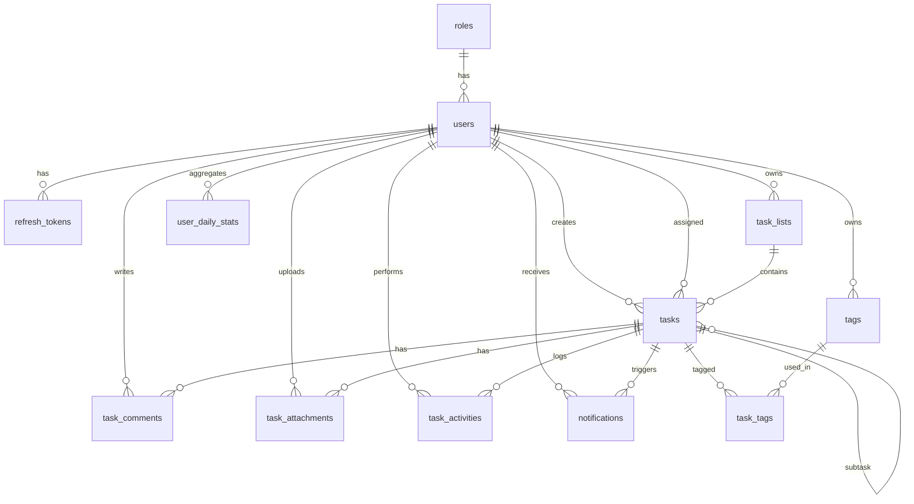

# Database Documentation

## Overview

- **Database**: MySQL 8.x
- **ORM**: TypeORM
- **Architecture**: Feature-based organization
- **Domain**: Task Management (Auth & Phân quyền, Danh sách, Công việc hôm nay, Thống kê, Lịch sử, Quản lý người dùng)

### Naming Conventions

| Element | Convention | Example |
|---------|------------|---------|
| Tables | snake_case, plural | `tasks`, `task_activities` |
| Columns | snake_case | `created_at`, `assignee_id` |
| Foreign Keys | `[singular_table]_id` | `task_id`, `list_id` |
| Indexes | `idx_[table]_[column]` | `idx_tasks_due_date` |
| Join tables | `[table_a]_[table_b]` | `task_tags` |

---

## Entities by Feature

### Auth Feature

**roles**
| Column | Type | Constraints | Description |
|--------|------|-------------|-------------|
| id | BIGINT | PK, AUTO_INCREMENT | |
| name | VARCHAR(50) | NOT NULL, UNIQUE | `admin` / `member` |
| description | VARCHAR(255) | NULLABLE | Mô tả quyền |

**users**
| Column | Type | Constraints | Description |
|--------|------|-------------|-------------|
| id | BIGINT | PK, AUTO_INCREMENT | |
| role_id | BIGINT | FK → roles, NOT NULL | Phân quyền |
| email | VARCHAR(255) | NOT NULL, UNIQUE | Dùng để đăng nhập |
| password_hash | VARCHAR(255) | NOT NULL | Bcrypt/Argon2 |
| full_name | VARCHAR(100) | NOT NULL | |
| avatar_url | VARCHAR(500) | NULLABLE | |
| timezone | VARCHAR(50) | DEFAULT 'Asia/Ho_Chi_Minh' | ⚠️ Quyết định mốc "hôm nay" |
| is_active | BOOLEAN | DEFAULT TRUE | Admin khoá/mở tài khoản |
| last_login_at | DATETIME | NULLABLE | Hiển thị ở trang người dùng |
| created_at | DATETIME | AUTO | |
| updated_at | DATETIME | AUTO | |

**refresh_tokens**
| Column | Type | Constraints | Description |
|--------|------|-------------|-------------|
| id | BIGINT | PK, AUTO_INCREMENT | |
| user_id | BIGINT | FK → users, NOT NULL | Token owner |
| token_hash | VARCHAR(255) | NOT NULL, UNIQUE | Hashed token (never plain) |
| device_name | VARCHAR(100) | NULLABLE | "Chrome on Windows" |
| ip_address | VARCHAR(45) | NULLABLE | IPv4/IPv6 |
| user_agent | VARCHAR(255) | NULLABLE | Browser/app info |
| expires_at | DATETIME | NOT NULL | Expiration time |
| is_revoked | BOOLEAN | DEFAULT FALSE | Soft revoke flag |
| created_at | DATETIME | AUTO | |

### Task List Feature

**task_lists** (nhóm công việc / project / bảng)
| Column | Type | Constraints | Description |
|--------|------|-------------|-------------|
| id | BIGINT | PK, AUTO_INCREMENT | |
| owner_id | BIGINT | FK → users, NOT NULL | Người tạo danh sách |
| name | VARCHAR(100) | NOT NULL | "Cá nhân", "Dự án A" |
| description | VARCHAR(255) | NULLABLE | |
| color | VARCHAR(7) | NULLABLE | Hex `#4F46E5` |
| sort_order | INT | DEFAULT 0 | Thứ tự hiển thị |
| is_archived | BOOLEAN | DEFAULT FALSE | Soft delete |
| created_at | DATETIME | AUTO | |
| updated_at | DATETIME | AUTO | |

*UNIQUE (`owner_id`, `name`) — không trùng tên danh sách trong cùng 1 user.*

### Task Feature

**tasks** ⚠️ *Bảng trung tâm — mọi feature khác đều liên kết về đây*
| Column | Type | Constraints | Description |
|--------|------|-------------|-------------|
| id | BIGINT | PK, AUTO_INCREMENT | |
| list_id | BIGINT | FK → task_lists, NULLABLE | NULL = task rời (Inbox) |
| parent_task_id | BIGINT | FK → tasks, NULLABLE | Self-ref cho subtask |
| creator_id | BIGINT | FK → users, NOT NULL | Người tạo |
| assignee_id | BIGINT | FK → users, NULLABLE | Người thực hiện |
| title | VARCHAR(255) | NOT NULL | |
| description | TEXT | NULLABLE | Markdown |
| status | VARCHAR(20) | ENUM: todo/in_progress/done/cancelled | DEFAULT `todo` |
| priority | VARCHAR(10) | ENUM: low/medium/high/urgent | DEFAULT `medium` |
| start_date | DATETIME | NULLABLE | |
| due_date | DATETIME | NULLABLE | ⚠️ Nguồn của trang "Hôm nay" |
| completed_at | DATETIME | NULLABLE | ⚠️ Nguồn của trang "Thống kê" |
| estimate_minutes | INT | NULLABLE | Thời lượng dự kiến |
| recurrence_rule | VARCHAR(100) | NULLABLE | RRULE, vd `FREQ=DAILY`. Ghi qua `POST/PATCH /tasks` |
| sort_order | INT | DEFAULT 0 | Kéo-thả trong danh sách |
| is_archived | BOOLEAN | DEFAULT FALSE | Soft delete |
| created_at | DATETIME | AUTO | |
| updated_at | DATETIME | AUTO | |

**tags**
| Column | Type | Constraints | Description |
|--------|------|-------------|-------------|
| id | BIGINT | PK, AUTO_INCREMENT | |
| user_id | BIGINT | FK → users, NULLABLE | NULL = tag hệ thống (admin tạo) |
| name | VARCHAR(50) | NOT NULL | |
| color | VARCHAR(7) | NULLABLE | Hex |

*UNIQUE (`user_id`, `name`).*

**task_tags** (join table N:N)
| Column | Type | Constraints |
|--------|------|-------------|
| task_id | BIGINT | PK (composite), FK → tasks |
| tag_id | BIGINT | PK (composite), FK → tags |

**task_comments**
| Column | Type | Constraints |
|--------|------|-------------|
| id | BIGINT | PK, AUTO_INCREMENT |
| task_id | BIGINT | FK → tasks |
| user_id | BIGINT | FK → users |
| content | TEXT | NOT NULL |
| created_at | DATETIME | AUTO |
| updated_at | DATETIME | AUTO |

**task_attachments**
| Column | Type | Constraints | Description |
|--------|------|-------------|-------------|
| id | BIGINT | PK, AUTO_INCREMENT | |
| task_id | BIGINT | FK → tasks | |
| uploaded_by | BIGINT | FK → users | |
| file_url | VARCHAR(500) | NOT NULL | S3/local path |
| file_name | VARCHAR(255) | NOT NULL | |
| file_size | INT | NOT NULL | Bytes |
| mime_type | VARCHAR(100) | NOT NULL | |
| created_at | DATETIME | AUTO | |

### History Feature

**task_activities** — *Snapshot data for history integrity*
| Column | Type | Constraints | Description |
|--------|------|-------------|-------------|
| id | BIGINT | PK, AUTO_INCREMENT | |
| task_id | BIGINT | FK → tasks, NULLABLE | NULL khi task đã bị xoá cứng |
| user_id | BIGINT | FK → users, NOT NULL | Người thao tác |
| action | VARCHAR(30) | ENUM: created/updated/status_changed/assigned/commented/archived/deleted | |
| field_name | VARCHAR(50) | NULLABLE | `status`, `due_date`… |
| old_value | VARCHAR(255) | NULLABLE | Giá trị cũ |
| new_value | VARCHAR(255) | NULLABLE | Giá trị mới |
| task_title | VARCHAR(255) | Snapshot | Giữ nguyên tên task tại thời điểm log |
| metadata | JSON | NULLABLE | Payload phụ (ip, source…) |
| created_at | DATETIME | AUTO | |

*Bảng append-only: chỉ INSERT, không UPDATE/DELETE.*

### Notification Feature

**notifications**
| Column | Type | Constraints | Description |
|--------|------|-------------|-------------|
| id | BIGINT | PK, AUTO_INCREMENT | |
| user_id | BIGINT | FK → users | Người nhận |
| task_id | BIGINT | FK → tasks, NULLABLE | |
| type | VARCHAR(30) | ENUM: due_soon/overdue/assigned/commented | |
| message | VARCHAR(255) | NOT NULL | |
| is_read | BOOLEAN | DEFAULT FALSE | |
| created_at | DATETIME | AUTO | |

### Statistics Feature

**user_daily_stats** — *Bảng tổng hợp (optional, cho dashboard nhanh)*
| Column | Type | Constraints | Description |
|--------|------|-------------|-------------|
| id | BIGINT | PK, AUTO_INCREMENT | |
| user_id | BIGINT | FK → users | |
| stat_date | DATE | NOT NULL | |
| tasks_created | INT | DEFAULT 0 | |
| tasks_completed | INT | DEFAULT 0 | |
| tasks_overdue | INT | DEFAULT 0 | |

*UNIQUE (`user_id`, `stat_date`). Ghi bằng cron job chạy cuối ngày. Nếu dữ liệu còn nhỏ (< ~100k tasks) có thể bỏ bảng này và tính trực tiếp bằng `GROUP BY` trên `tasks`.*

---

## ERD Diagram



---

## Key Relationships

| Relationship | Type | Notes |
|--------------|------|-------|
| roles → users | 1:N | Role-based access (admin / member) |
| users → refresh_tokens | 1:N | Multi-device support |
| users → task_lists | 1:N | Mỗi danh sách thuộc 1 owner |
| tasks → tasks | 1:N | Self-ref cho subtask (`parent_task_id`) |
| **tasks** → comments, attachments, activities | 1:N | ⚠️ Bảng trung tâm |
| tasks ↔ tags | N:N | Qua `task_tags` |
| users → tasks (`creator_id`) | 1:N | Người tạo |
| users → tasks (`assignee_id`) | 1:N | Người thực hiện, có thể NULL |
| task_activities.task_title | Snapshot | Lịch sử vẫn đọc được khi task bị xoá |

---

## Conventions

- **Primary Key**: Auto-increment BIGINT (`id`)
- **Soft Delete**: `is_archived` (tasks, task_lists), `is_active` (users), `is_revoked` (tokens)
- **Timestamps**: `created_at`, `updated_at` (TypeORM auto-managed)
- **Enums**: Stored as strings
- **Token Storage**: Always hashed (`token_hash`), never plain text
- **Datetime**: Lưu UTC, quy đổi theo `users.timezone` ở tầng ứng dụng
- **Colors**: Hex 7 ký tự (`#RRGGBB`)
- **Audit**: Mọi thay đổi trên `tasks` phải sinh 1 bản ghi `task_activities`

---

## Permission Matrix

| Chức năng | member | admin |
|-----------|--------|-------|
| CRUD task của mình | ✅ | ✅ |
| Xem task của người khác | ❌ | ✅ |
| Gán task cho người khác | ❌ | ✅ |
| Trang thống kê (cá nhân) | ✅ | ✅ |
| Trang thống kê (toàn hệ thống) | ❌ | ✅ |
| Lịch sử của mình | ✅ | ✅ |
| Lịch sử toàn hệ thống | ❌ | ✅ |
| **Trang quản lý người dùng** | ❌ | ✅ |
| Khoá/mở tài khoản, đổi role | ❌ | ✅ |

*Enforce ở tầng service (guard theo `role_id`), không chỉ ẩn ở UI.*

---

## Indexes

```sql
-- Auth
CREATE INDEX idx_users_email ON users(email);
CREATE INDEX idx_users_role_id ON users(role_id);
CREATE INDEX idx_refresh_tokens_token_hash ON refresh_tokens(token_hash);
CREATE INDEX idx_refresh_tokens_user_id ON refresh_tokens(user_id);
CREATE INDEX idx_refresh_tokens_expires_at ON refresh_tokens(expires_at);

-- Tasks
CREATE INDEX idx_tasks_list_id ON tasks(list_id);
CREATE INDEX idx_tasks_parent_task_id ON tasks(parent_task_id);
CREATE INDEX idx_tasks_status ON tasks(status);
CREATE INDEX idx_tasks_due_date ON tasks(due_date);
CREATE INDEX idx_tasks_completed_at ON tasks(completed_at);
-- Composite: trang "Công việc hôm nay"
CREATE INDEX idx_tasks_assignee_due ON tasks(assignee_id, due_date, status);
-- Composite: trang "Thống kê"
CREATE INDEX idx_tasks_assignee_completed ON tasks(assignee_id, completed_at);

-- Task Lists
CREATE INDEX idx_task_lists_owner_id ON task_lists(owner_id);

-- Tags
CREATE INDEX idx_task_tags_tag_id ON task_tags(tag_id);

-- History
CREATE INDEX idx_task_activities_task_id ON task_activities(task_id);
CREATE INDEX idx_task_activities_user_created ON task_activities(user_id, created_at);

-- Notifications
CREATE INDEX idx_notifications_user_read ON notifications(user_id, is_read);

-- Statistics
CREATE INDEX idx_user_daily_stats_date ON user_daily_stats(stat_date);
```

---

## Query Patterns theo trang

| Trang | Truy vấn chính |
|-------|----------------|
| Đăng nhập | `SELECT ... FROM users WHERE email = ? AND is_active = TRUE` |
| Danh sách | `SELECT ... FROM tasks WHERE list_id = ? AND is_archived = FALSE ORDER BY sort_order` |
| Công việc hôm nay | `WHERE assignee_id = ? AND due_date >= :startOfDay AND due_date < :endOfDay AND status NOT IN ('done','cancelled')` |
| Quá hạn | `WHERE assignee_id = ? AND due_date < NOW() AND status NOT IN ('done','cancelled')` |
| Thống kê | `GROUP BY DATE(completed_at)` trên `tasks`, hoặc đọc `user_daily_stats` |
| Lịch sử | `FROM task_activities WHERE user_id = ? ORDER BY created_at DESC LIMIT ? OFFSET ?` |
| Người dùng (admin) | `FROM users JOIN roles ... ORDER BY created_at DESC` |

*Mốc `:startOfDay` / `:endOfDay` phải tính theo `users.timezone`, không dùng `CURDATE()` của MySQL.*

---

## Migration Rules

- **Format**: `[timestamp]_[description].ts` (e.g., `1699999999999_create_tasks_table.ts`)
- **Reversible**: Always implement both `up()` and `down()` methods
- **No data loss**: Rollback must preserve data integrity
- **Seed bắt buộc**: `roles` (`admin`, `member`) + 1 tài khoản admin mặc định

---

## TypeORM Notes

```typescript
// Example: tasks entity
@Entity('tasks')
export class Task {
  @PrimaryGeneratedColumn('increment', { type: 'bigint' })
  id: number;

  @ManyToOne(() => TaskList, (list) => list.tasks, { nullable: true })
  @JoinColumn({ name: 'list_id' })
  list: TaskList;

  // Self-referencing: subtask
  @ManyToOne(() => Task, (task) => task.subtasks, { nullable: true })
  @JoinColumn({ name: 'parent_task_id' })
  parent: Task;

  @OneToMany(() => Task, (task) => task.parent)
  subtasks: Task[];

  @ManyToOne(() => User, { nullable: true })
  @JoinColumn({ name: 'assignee_id' })
  assignee: User;

  @ManyToMany(() => Tag, (tag) => tag.tasks)
  @JoinTable({
    name: 'task_tags',
    joinColumn: { name: 'task_id' },
    inverseJoinColumn: { name: 'tag_id' },
  })
  tags: Tag[];
}
```

**Best Practices**:
- Cascade trên `task → task_comments`, `task → task_attachments`, `task → task_tags`
- **Không** cascade trên `task → task_activities` (lịch sử phải sống sót)
- Đặt `onDelete: 'SET NULL'` cho `tasks.assignee_id` khi xoá user
- Dùng transaction khi đổi `status` sang `done`: cập nhật `completed_at` + insert `task_activities`
- Hạn chế eager loading; dùng `QueryBuilder` + `leftJoinAndSelect` khi cần
- Cron job: dọn `refresh_tokens` hết hạn, sinh task lặp lại từ `recurrence_rule`, tổng hợp `user_daily_stats`

---

## Refresh Token Use Cases

| Action | Implementation |
|--------|----------------|
| Login | Create new `refresh_tokens` record |
| Refresh | Find by `token_hash`, validate `expires_at` & `is_revoked` |
| Logout | Set `is_revoked = true` for current token |
| Logout all | Set `is_revoked = true` WHERE `user_id = ?` |
| View sessions | List WHERE `is_revoked = false AND expires_at > NOW()` |
| Admin khoá user | Set `users.is_active = false` + revoke toàn bộ token của user |

---

## Task Status Flow

| Từ → Đến | Side effect |
|----------|-------------|
| `todo` → `in_progress` | Log `status_changed` |
| `in_progress` → `done` | Set `completed_at = NOW()`, log `status_changed` |
| `done` → `todo` / `in_progress` | Set `completed_at = NULL`, log `status_changed` |
| any → `cancelled` | Giữ `completed_at = NULL`, không tính vào thống kê hoàn thành |
