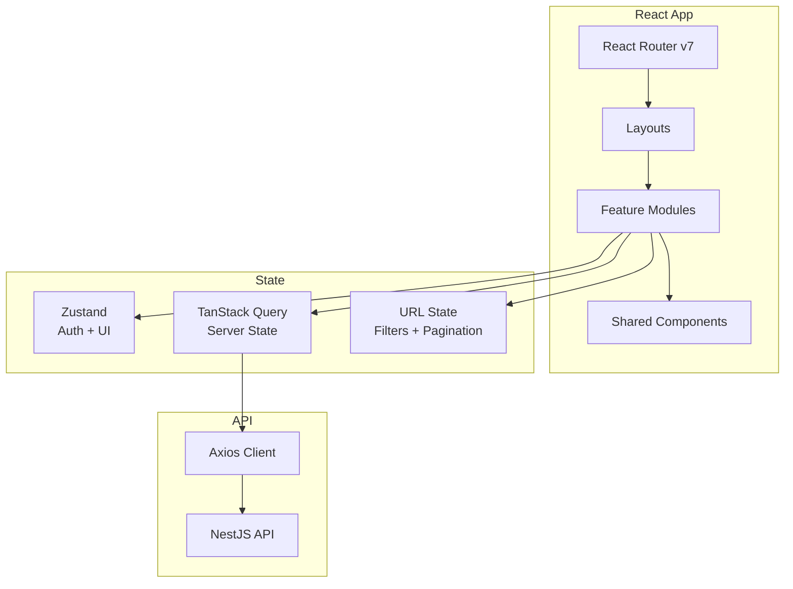
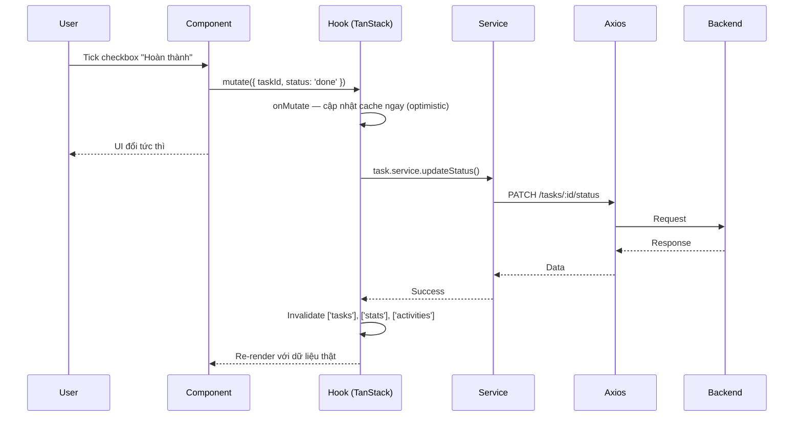
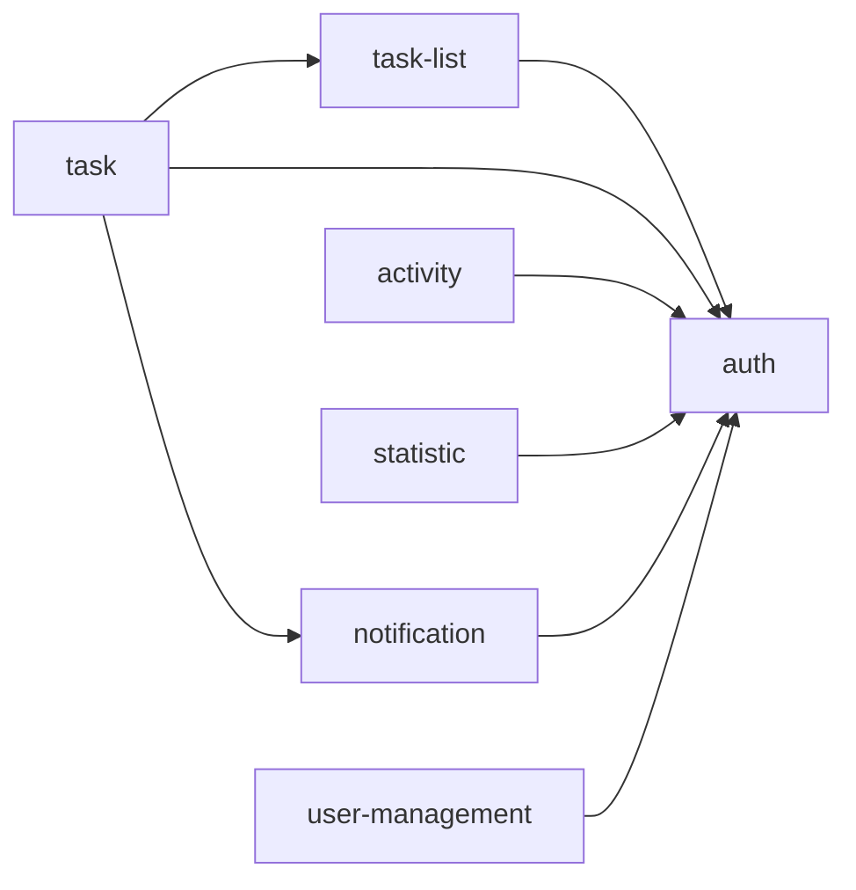

# Frontend Architecture

## Overview



**Architecture**: Feature-based modules (self-contained)

Tên feature ở FE **trùng với tên feature ở BE** (`task`, `activity`, `statistic`...). Khi sửa một nghiệp vụ, hai bên mở cùng một thư mục.

### Tech Stack Justification

| Tech | Why |
|------|-----|
| React 19 + Vite | Fast HMR, modern React features |
| TypeScript strict | Type safety, better DX |
| TanStack Query | Server state, caching, optimistic update khi tick hoàn thành |
| Zustand | Minimal global state (auth, UI preference) |
| React Router v7 | Type-safe routes, modern API |
| Tailwind CSS | Utility-first, consistent design |
| Recharts | Biểu đồ trang Thống kê |
| dnd-kit | Kéo-thả sắp xếp task, hỗ trợ bàn phím |
| Luxon | Quy đổi timezone cho trang "Hôm nay" |

---

## Folder Structure

```
src/
├── main.tsx                    # Entry point
├── App.tsx                     # Providers wrapper
├── config/
│   └── constants.ts            # API_BASE_URL, PAGE_SIZE
├── routes/
│   ├── index.tsx               # createBrowserRouter
│   ├── routes.ts               # ROUTES constants
│   ├── ProtectedRoute.tsx
│   └── AdminRoute.tsx
├── shared/
│   ├── components/
│   │   ├── ui/                 # Button, Input, Modal, Select, Badge
│   │   ├── feedback/           # Toast, Skeleton, Spinner, EmptyState
│   │   └── layout/             # Header, Sidebar
│   ├── hooks/                  # useDebounce, useMediaQuery
│   ├── lib/
│   │   ├── axios.ts            # Axios + interceptors
│   │   ├── queryClient.ts      # TanStack config
│   │   └── datetime.ts         # formatDate, toUserTimezone
│   ├── constants/
│   │   └── error-messages.ts   # Map TASK_001 → message tiếng Việt
│   ├── types/                  # ApiResponse, PaginatedResponse, ApiError
│   └── utils/                  # cn, groupBy
├── layouts/
│   ├── MainLayout.tsx          # Sidebar + Header
│   ├── AuthLayout.tsx
│   └── AdminLayout.tsx
├── features/
│   ├── auth/
│   ├── task-list/
│   ├── task/
│   ├── activity/
│   ├── statistic/
│   ├── notification/
│   └── user-management/
└── assets/
```

---

## Feature Anatomy

### Auth Feature
```
features/auth/
├── components/
│   ├── LoginForm.tsx
│   └── RegisterForm.tsx
├── hooks/
│   ├── useLogin.ts             # useMutation
│   ├── useRegister.ts          # useMutation
│   └── useCurrentUser.ts       # useQuery /auth/me
├── services/
│   └── auth.service.ts
├── stores/
│   └── auth.store.ts           # user, accessToken (memory), isAuthenticated
├── types/
├── pages/
│   ├── LoginPage.tsx
│   └── RegisterPage.tsx
└── index.ts
```

### Task Feature (lớn nhất — nhiều view trên cùng nguồn dữ liệu)
```
features/task/
├── components/
│   ├── TaskItem.tsx            # 1 dòng task, có checkbox toggle
│   ├── TaskList.tsx
│   ├── TaskFilters.tsx         # status, priority, tag → URL params
│   ├── TaskFormModal.tsx       # tạo / sửa
│   ├── TaskDetailDrawer.tsx    # panel chi tiết + comment + đính kèm
│   ├── SubtaskList.tsx
│   ├── StatusBadge.tsx
│   ├── PrioritySelect.tsx
│   └── TagPicker.tsx
├── hooks/
│   ├── useTasks.ts             # useQuery + filters từ URL
│   ├── useTodayTasks.ts        # useQuery /tasks/today
│   ├── useCreateTask.ts        # useMutation
│   ├── useUpdateTaskStatus.ts  # useMutation + optimistic update
│   └── useReorderTasks.ts      # useMutation + optimistic reorder
├── services/
│   └── task.service.ts
├── types/
│   └── task.types.ts
├── pages/
│   ├── TodayPage.tsx           # Công việc hôm nay
│   ├── TaskListPage.tsx        # Danh sách
│   └── TaskDetailPage.tsx
└── index.ts
```

### Statistic Feature
```
features/statistic/
├── components/
│   ├── SummaryCards.tsx        # created / completed / overdue / rate
│   ├── CompletionChart.tsx     # Recharts LineChart theo ngày
│   ├── StatusPieChart.tsx
│   ├── PriorityBarChart.tsx
│   └── DateRangePicker.tsx     # → URL params
├── hooks/
│   ├── useStatsSummary.ts
│   └── useCompletionTrend.ts
├── services/
│   └── statistic.service.ts
├── pages/
│   └── StatisticPage.tsx
└── index.ts
```

---

## Data Flow



**Nếu request lỗi**: `onError` rollback cache về snapshot cũ và hiện toast. Checkbox tự bật lại — người dùng thấy ngay thao tác chưa được lưu.

### Example: Complete Task Flow

```
1. User tick checkbox trên TaskItem
2. useUpdateTaskStatus().mutate({ id, status: 'done' })
3. onMutate → cancelQueries + setQueryData (đánh dấu done trong cache)
4. Service → PATCH /tasks/:id/status
5. Success → invalidate ['tasks'], ['tasks','today'], ['stats'], ['activities']
6. Error TASK_005 (còn subtask chưa xong) → rollback + toast "Còn công việc con chưa hoàn thành"
```

### Example: Today Page Flow

```
1. TodayPage mount → useTodayTasks()
2. GET /tasks/today (server tự tính mốc ngày theo timezone user)
3. Response tách sẵn { overdue[], today[], counters }
4. Render 2 nhóm riêng: "Quá hạn" (đỏ) và "Hôm nay"
5. FE KHÔNG tự lọc lại theo ngày — chỉ hiển thị đúng thứ server trả
```

---

## Routing (React Router v7)

### Route Constants

```ts
// routes/routes.ts
export const ROUTES = {
  LOGIN: '/login',
  REGISTER: '/register',

  TODAY: '/',                      // Trang mặc định sau đăng nhập
  TASKS: '/tasks',
  TASK_DETAIL: '/tasks/:id',
  LISTS: '/lists',
  LIST_DETAIL: '/lists/:id',
  STATISTIC: '/statistic',
  HISTORY: '/history',
  PROFILE: '/profile',

  ADMIN_USERS: '/admin/users',
  ADMIN_USER_DETAIL: '/admin/users/:id',
  ADMIN_HISTORY: '/admin/history',
  ADMIN_STATISTIC: '/admin/statistic',
} as const;
```

### Route Config

```tsx
// routes/index.tsx
import { createBrowserRouter } from 'react-router';

export const router = createBrowserRouter([
  {
    element: <AuthLayout />,
    children: [
      { path: ROUTES.LOGIN, element: <LoginPage /> },
      { path: ROUTES.REGISTER, element: <RegisterPage /> },
    ],
  },
  {
    element: <ProtectedRoute />,
    children: [
      {
        element: <MainLayout />,
        children: [
          { index: true, element: <TodayPage /> },
          { path: 'tasks', element: <TaskListPage /> },
          { path: 'tasks/:id', element: <TaskDetailPage /> },
          { path: 'lists/:id', element: <TaskListPage /> },
          { path: 'statistic', element: <StatisticPage /> },
          { path: 'history', element: <HistoryPage /> },
          { path: 'profile', element: <ProfilePage /> },
        ],
      },
    ],
  },
  {
    path: '/admin',
    element: <AdminRoute />,
    children: [
      {
        element: <AdminLayout />,
        children: [
          { path: 'users', element: <UserListPage /> },
          { path: 'users/:id', element: <UserDetailPage /> },
          { path: 'history', element: <AdminHistoryPage /> },
          { path: 'statistic', element: <AdminStatisticPage /> },
        ],
      },
    ],
  },
  { path: '*', element: <NotFoundPage /> },
]);
```

`AdminRoute` kiểm tra `user.role === 'admin'` và redirect về `ROUTES.TODAY` nếu không đủ quyền. **Đây chỉ là UX** — server vẫn chặn độc lập bằng `RolesGuard`.

### Navigation

```tsx
import { useNavigate, useParams, useSearchParams } from 'react-router';

const navigate = useNavigate();
const { id } = useParams<{ id: string }>();
const [searchParams, setSearchParams] = useSearchParams();

// Navigate
navigate(ROUTES.TASK_DETAIL.replace(':id', String(taskId)));

// URL state for filters
setSearchParams({ status: 'todo,in_progress', priority: 'high', page: '1' });
```

---

## State Management

| State Type | Tool | Example |
|------------|------|---------|
| Server state | TanStack Query | tasks, lists, activities, stats |
| Auth state | Zustand | user, accessToken, isAuthenticated |
| UI preference | Zustand + persist | sidebar collapsed, view mode (list/board) |
| URL state | useSearchParams | filters, sort, pagination, date range |
| Form state | React Hook Form | task form, login, profile |
| Local UI | useState | modal open, drawer open, dropdown |

### Rules

- ✅ Server data → TanStack Query (NEVER Zustand)
- ✅ Auth + UI preference → Zustand (cross-feature access)
- ✅ Filters, phân trang, khoảng ngày → URL params (chia sẻ được link)
- ✅ Forms → React Hook Form + Zod
- ❌ Don't store API data in Zustand
- ❌ Don't persist `accessToken` vào localStorage — giữ trong memory, refresh token nằm ở httpOnly cookie

### Query Key Conventions

| Key | Dữ liệu |
|-----|---------|
| `['tasks', filters]` | Danh sách task theo bộ lọc |
| `['tasks', 'today']` | Trang Hôm nay |
| `['tasks', id]` | Chi tiết 1 task |
| `['lists']` | Danh sách các list |
| `['activities', filters]` | Lịch sử (useInfiniteQuery) |
| `['stats', 'summary', range]` | Thống kê tổng quan |
| `['notifications', 'unread-count']` | Badge thông báo |

**Invalidate sau khi đổi task**: `['tasks']` (prefix, quét hết mọi biến thể) + `['stats']` + `['activities']`. Quên `['stats']` là lỗi hay gặp nhất — người dùng tick xong quay sang trang Thống kê thấy số cũ.

---

## API Layer

```
axios.ts (interceptors)
    ↓
[feature].service.ts (endpoints)
    ↓
use[Feature].ts (TanStack hooks)
    ↓
Component.tsx (UI)
```

### Example

```ts
// services/task.service.ts
export const taskService = {
  getTasks: (params: TaskParams) =>
    axios.get<PaginatedResponse<Task>>('/tasks', { params }),
  getToday: () =>
    axios.get<ApiResponse<TodayTasks>>('/tasks/today'),
  updateStatus: (id: number, status: TaskStatus) =>
    axios.patch<ApiResponse<Task>>(`/tasks/${id}/status`, { status }),
};

// hooks/useTasks.ts
export const useTasks = (params: TaskParams) =>
  useQuery({
    queryKey: ['tasks', params],
    queryFn: () => taskService.getTasks(params),
  });
```

### Axios Interceptors

| Interceptor | Nhiệm vụ |
|-------------|----------|
| Request | Gắn `Authorization: Bearer <accessToken>` từ auth store |
| Response (success) | Bóc `response.data.data`, trả thẳng payload cho hook |
| Response (401) | Gọi `/auth/refresh` một lần, retry request gốc; thất bại → logout + redirect login |
| Response (error) | Chuẩn hoá về `ApiError { code, message, details }` |

**Chống refresh dồn**: khi nhiều request cùng nhận 401, chỉ gọi refresh một lần và xếp hàng các request còn lại chờ token mới.

---

## Cross-Feature Communication



| Method | Use Case |
|--------|----------|
| Zustand store | Auth state, tên user trên header, sidebar collapsed |
| TanStack cache | Danh sách list dùng chung cho sidebar và form tạo task |
| URL params | Filters, pagination, khoảng ngày thống kê |
| Barrel exports | Feature public API |

**Không có phụ thuộc vòng.** `task` dùng `task-list` để hiển thị tên list; `task-list` không biết gì về `task` (số lượng task lấy từ API trả kèm, không gọi ngược sang feature `task`).

---

## Shared vs Features

| Shared | Features |
|--------|----------|
| Button, Input, Modal, Select | TaskItem, TaskFilters, SummaryCards |
| useDebounce, useMediaQuery | useTasks, useTodayTasks |
| axios instance | task.service |
| ApiResponse, ApiError types | Task, TaskActivity types |
| formatDate, toUserTimezone | getTaskDueLabel ("Hôm nay", "Quá hạn 2 ngày") |
| Skeleton, Spinner, EmptyState | TaskListSkeleton |

### Import Rules

```tsx
// ✅ Features import from shared
import { Button } from '@/shared/components/ui';

// ✅ Features import other features' public API
import { useAuthStore } from '@/features/auth';

// ❌ Never import feature internals
import { TaskItem } from '@/features/task/components/TaskItem';
```
